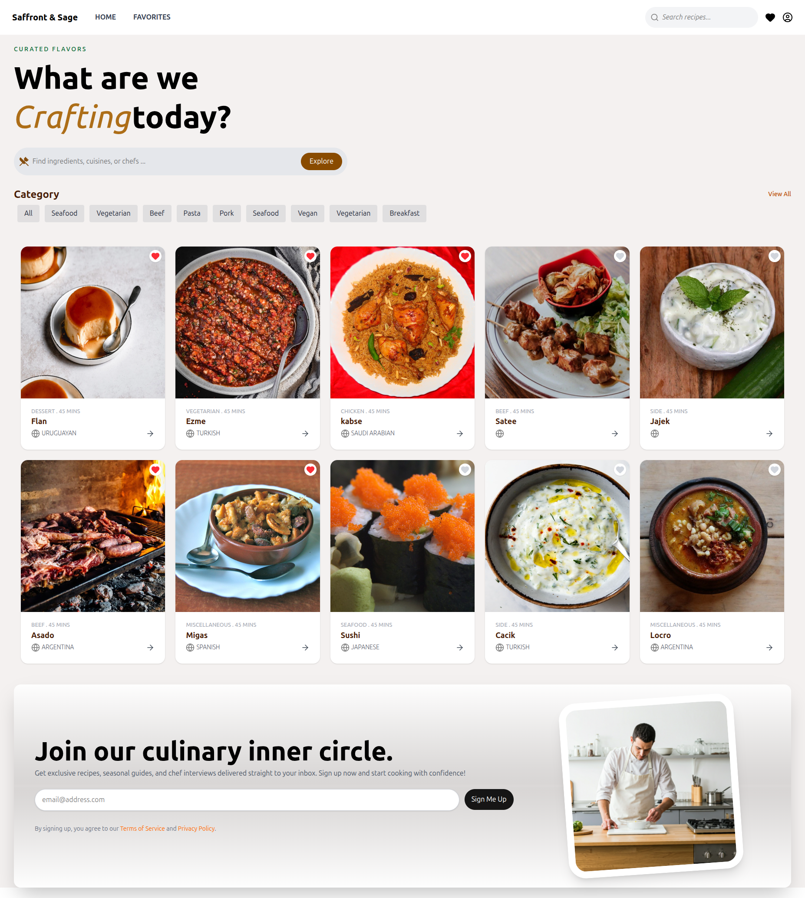

# Recipe App
This is a simple recipe app built with React. It allows users to search for recipes and view details about each recipe. The app uses the Spoonacular API to fetch recipe data.

## Features
- Search for recipes by keyword
- View recipe details including ingredients and instructions
- Responsive design for mobile and desktop

## Technologies Used
- React
- TypeScript
- Tailwind CSS
- Spoonacular API

## Installation
1. Clone the repository:
```bash
git clone -b feature/dev git@github.com:komoforbrandon/Recipe-App.git

```
2. Navigate to the project directory:
```bash
cd Recipe-App

```
3. Install dependencies:
```bash
npm install

```
4. Start the development server:
```bash
npm start

```
5. Open your browser and go to `http://localhost:3000` to view the app.

## 🔧 Available Scripts

- `npm run dev` - Start the development server
- `npm run build` - Build for production
- `npm run preview` - Preview the production build
- `npm run lint` - Run ESLint to check code quality

## Example Ouput



## 📁 Project Structure

```
src/
├── components/
│   │── ExploreBar.tsx    # Component for displaying recipe cards
│   ├── Loader.tsx       # Loading spinner
│   ├── Modal.tsx        # Modal component for recipe details
│   ├── searchBar.tsx    # Search input component
│   ├── signUp.tsx       # Sign-up form component
│   ├── RecipeCard.tsx   # Component for displaying individual recipe cards
│   ├── searchBar.tsx    # Search input component
│   └── readingListUI/   # Reading list specific components
├── pages/                   # Page components
│   ├── Home.tsx            # Home/search page
│   ├── BookDetails.tsx     # Book detail page
│   └── ReadingList.tsx     # Reading list page
├── context/                  # React contexts for state management
│   └── favorite-context.tsx # Book persistence context
├── services/               # API and external services
│   └── api.ts             # Open Library API integration
├── types/                  # TypeScript type definitions
│   └── type.ts            # App-wide types
└── routes/                # Routing configuration
    └── AppRoutes.tsx      # Route definitions

```

## Future Enhancements
- User authentication and personalized recipe collections
- Ability to save favorite recipes
- More detailed recipe information including nutrition facts
- Improved error handling and loading states

## 📝 License

This project is open source and available under the MIT License.

## 🤝 Contributing

Contributions are welcome! Feel free to:
1. Fork the repository
2. Create a feature branch (`git checkout -b dev`)
3. Commit your changes (`git commit -m 'Add some AmazingFeature'`)
4. Push to the branch (`git push origin dev`)
5. Open a Pull Request

## 💬 Support

If you encounter any issues or have questions, please open an issue on the repository.

---

**Built with passion using React and Vite**

## Author
Brandon Komofor - [GitHub](https://github.com/komoforbrandon)
